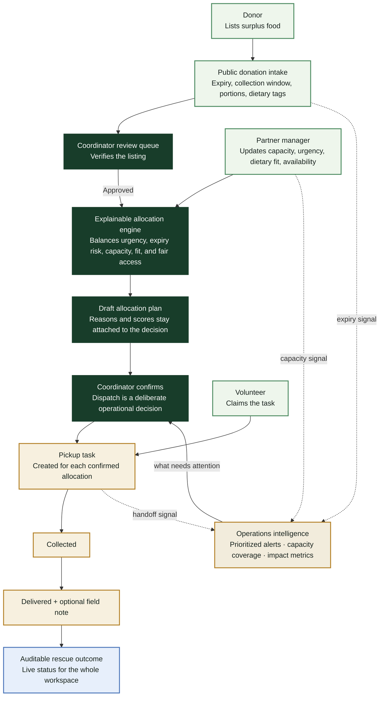
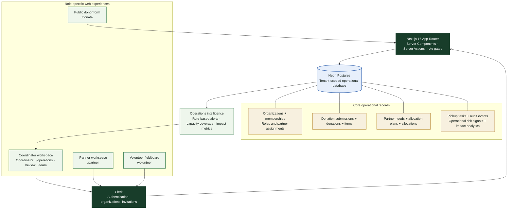

# Last Mile

<p align="center">
  <strong>Turn a time-sensitive food donation into a transparent, completed handoff.</strong><br />
  Operations software for food-rescue coordinators, community partners, and volunteers.
</p>

<p align="center">
  <a href="https://nextjs.org"></a>&nbsp;
  <a href="https://react.dev"></a>&nbsp;
  <a href="https://www.typescriptlang.org"></a>&nbsp;
  <a href="https://tailwindcss.com"></a>&nbsp;
  <a href="https://clerk.com"></a>&nbsp;
  <a href="https://neon.com"></a>&nbsp;
  <a href="https://www.postgresql.org"></a>&nbsp;
  <a href="https://vercel.com"></a>&nbsp;
  <a href="https://openai.com"></a>
</p>

Built for **OpenAI Build Week 2026** in the **Work & Productivity** category.

> **Built with Codex and GPT-5.6.** Last Mile was designed and implemented in Codex with GPT-5.6, from the multi-tenant role model and Neon data layer to the role-specific operational dashboards and workflow refinements.

## The problem

Food-rescue teams make urgent, high-consequence choices with fragmented information: food expires, partner capacity changes, collection windows close, and volunteers need a clear next action. A donation directory records supply; it does not coordinate the handoff.

Last Mile is a role-aware rescue workspace that moves a donation from public listing to reviewed allocation to volunteer-confirmed delivery—while preserving the reasons behind every decision.

## Why this is Work & Productivity

Last Mile is workflow software for a time-critical, multi-team operation. It replaces a coordinator's fragmented texts, spreadsheets, and status follow-ups with one shared operating system:

- **Workflow orchestration:** an approved donation becomes an explainable allocation plan, then coordinator-confirmed pickup tasks—without losing responsibility between teams.
- **Operational automation:** rules continuously surface expiring intake, unsigned plans, unclaimed pickups, and quiet in-progress handoffs in a prioritized signal queue.
- **Shared live context:** partner capacity, dietary fit, collection windows, and expiry risk are visible at the decision point instead of being reconstructed from messages.
- **Performance visibility:** meals rescued, before-expiry delivery, time to dispatch, volunteer coverage, and on-time delivery turn operational work into measurable outcomes.

Automation accelerates awareness and routing; it never silently allocates food or dispatches volunteers. The coordinator remains the accountable decision-maker.

## What is working

| Actor | Purpose | Product surface |
| --- | --- | --- |
| Donor | List surplus food without creating an account. | `/donate` |
| Coordinator | Creates a rescue workspace, invites the team, reviews donations, confirms allocation plans, dispatches handoffs, and monitors operational risk. | `/coordinator`, `/operations`, `/review`, `/team` |
| Partner manager | Keeps their organization’s capacity, dietary fit, urgency, and availability current. | `/partner` |
| Volunteer | Claims pickup tasks and records collection/delivery progress. | `/volunteer` |

## How Last Mile works



### Core capabilities

- Public donation intake with collection windows, expiry, portions, dietary tags, and contact details.
- Coordinator review queue that turns an approved submission into a draft allocation plan.
- Deterministic, explainable allocation based on expiry risk, dietary fit, partner capacity, urgency, and fair access.
- Explicit confirmation before pickup tasks are dispatched.
- Role-specific workspaces protected by Clerk organization membership and Last Mile role records.
- Coordinator invitations that assign either a partner manager (and their partner) or a volunteer before they enter the workspace.
- Volunteer claim, collection, and delivery lifecycle with an audit trail.
- Operations intelligence dashboard with meals rescued, before-expiry delivery, dispatch time, partner-capacity coverage, and live risk signals for expiring intake, unsigned plans, unclaimed pickups, and stalled handoffs.
- Apache ECharts operational pulse visualizing the latest seven days of delivered meals and dispatched handoffs from the active workspace&apos;s records.
- Full-width operational route map for coordinator and volunteer context, with pickup/destination pins and clearly scoped route lines when location data is available.
- Tenant-scoped Neon Postgres data so each rescue organization sees only its own operations.

The data model and allocation rationale are documented in [docs/blueprint.md](docs/blueprint.md).

## System architecture



## Why this fits OpenAI Build Week

Last Mile is designed to demonstrate the four judging dimensions directly:

| Criterion | Evidence in Last Mile |
| --- | --- |
| Technological implementation | A working Next.js application with Clerk-authenticated organizations, tenant-scoped Neon operations data, role gates, server-side actions, rule-based alerting, and an end-to-end dispatch workflow. |
| Design | Each actor lands in a focused workspace with only the next decision or action they need to make; coordinators also get a calm, prioritized operations view instead of another raw data table. |
| Potential impact | It targets a concrete operational failure: safe food goes to waste when expiring supply cannot be matched and collected in time. |
| Quality of idea | It combines explainable allocation with productivity automation: risk is detected and routed quickly, but allocation and dispatch remain auditable human decisions. |

## Built with Codex and GPT-5.6

Codex and GPT-5.6 were central to the build—not added as an afterthought:

- Designed the four-actor model and the protected onboarding path that sends each person to the right workspace.
- Built the Next.js, Clerk, and Neon integration, including tenant-scoped queries and role-aware invitations.
- Shaped the deterministic allocation workflow and its audit-friendly explanations.
- Diagnosed production-schema failures and refined the operational coordinator, partner, and volunteer interfaces.
- Iterated on the responsive dashboards, live route visualization, loading states, and judge walkthrough.
- Built the operations-intelligence view that turns time-sensitive operational data into transparent alerts and impact metrics, without handing decisions to a black box.

There is **no runtime OpenAI API dependency**: the value to the end user comes from deterministic, inspectable operational logic. That is intentional—coordinators must be able to understand why food was allocated, even under time pressure.

## Tech stack

- [Next.js 16](https://nextjs.org) + [React 19](https://react.dev) + [TypeScript](https://www.typescriptlang.org) for the application.
- [Tailwind CSS](https://tailwindcss.com) for the interface.
- [Apache ECharts 6](https://echarts.apache.org) for accessible, responsive operations analytics rendered in the browser.
- [Clerk](https://clerk.com) for sign-in, organization membership, invitations, and active-workspace context.
- [Neon](https://neon.com) + [PostgreSQL](https://www.postgresql.org) for serverless, tenant-scoped operational data.
- [Vercel](https://vercel.com) for deployment.
- [Codex and GPT-5.6](https://openai.com) for the build process.

## Run locally

### Prerequisites

- Node.js 20 or later
- pnpm
- A Neon Postgres database
- A Clerk application with Organizations enabled

### Setup

```bash
pnpm install
cp .env.example .env.local
pnpm dev
```

Open [http://localhost:3000](http://localhost:3000). Do not run the development server with `sudo`; Next.js writes local build files that should remain owned by your user.

Set these values in `.env.local` before starting the app:

| Name | Required | Purpose |
| --- | --- | --- |
| `DATABASE_URL` | Yes | Neon’s pooled Postgres connection string; server-only. |
| `NEXT_PUBLIC_APP_URL` | Yes | Canonical application URL, without a trailing slash. |
| `NEXT_PUBLIC_CLERK_PUBLISHABLE_KEY` | Yes | Clerk browser key. |
| `CLERK_SECRET_KEY` | Yes | Clerk server key; never expose it to the browser. |

Apply [src/db/schema.sql](src/db/schema.sql) to a new Neon database or branch before using the application. For an existing database, apply only the migrations that have not already been applied—do not replay `CREATE TYPE`, `CREATE TABLE`, or `ALTER TABLE` statements blindly against production.

### Starter data

New coordinator workspaces are seeded once with three starter community partners and a current capacity record for each: Harbor House, North Star Shelter, and Cedar Community Fridge. The exact seed fixture is versioned in [src/db/starter-network.ts](src/db/starter-network.ts) and is inserted by [seedStarterPartners](src/lib/db.ts#L246) during coordinator onboarding.

This is **not hardcoded dashboard content**. The coordinator, partner, volunteer, map, metrics, automated signal queue, and ECharts pulse all query the active organization&apos;s tenant-scoped Neon records at request time. The starter fixture exists only to make a new workspace useful on first run; donations, allocations, handoffs, delivery events, and analytics are created through the real workflow.

### Quality checks

```bash
pnpm lint
pnpm build
```

## Judge walkthrough

1. Sign up and choose **I coordinate food rescue** to create a rescue workspace.
2. From **Team**, invite a partner manager and/or volunteer. The coordinator assigns the Last Mile role; invitees should choose the invited-team path and accept the invitation.
3. As a partner manager, update capacity, urgency, dietary needs, and availability.
4. Submit a public donation at `/donate`.
5. As coordinator, review and approve it at `/review`, then confirm the allocation plan from `/coordinator`.
6. Visit **Operations** to show the live risk queue, Apache ECharts seven-day operational pulse, partner-capacity view, and impact metrics generated from Neon data.
7. As a volunteer, claim the dispatched pickup and move it through collected and delivered.

This sequence demonstrates the product’s complete operational loop instead of isolated screens.

## Development principles

- Enforce workspace scoping on every data access path.
- Keep allocation explanations as first-class data, not generated UI copy.
- Prefer deterministic and testable matching over opaque decisions.
- Never commit secrets, real donor/partner data, or volunteer credentials.
